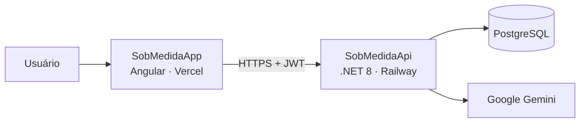
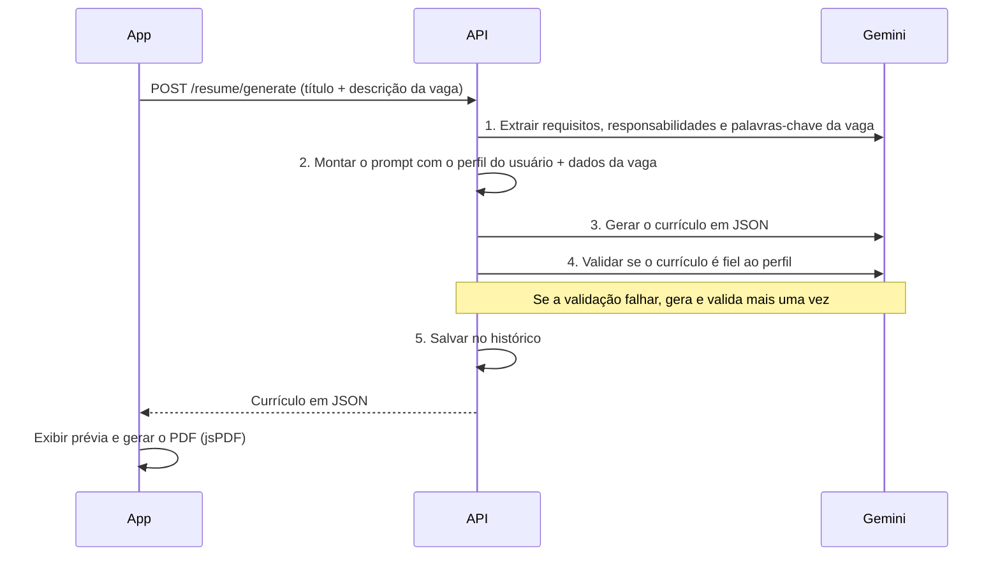

# Sob Medida

Gerador de currículos personalizados com IA. O usuário cadastra seu perfil profissional uma única vez (ou importa de um currículo em PDF) e, para cada vaga, cola a descrição dela: a aplicação gera um currículo adaptado àquela vaga, usando **apenas** informações reais do perfil, e permite baixá-lo em PDF.

🔗 **Aplicação:** https://sob-medida.vercel.app

## Funcionalidades

- **Cadastro e login** com autenticação JWT.
- **Perfil profissional** dividido em dados pessoais, experiências, formação, habilidades, projetos e certificações.
- **Importação de currículo em PDF**: a IA extrai os dados do PDF, o usuário revisa uma prévia e confirma o que entra no perfil.
- **Geração de currículo por vaga**: a IA analisa a descrição da vaga e reescreve o perfil destacando o que é relevante para ela.
- **Validação anti-alucinação**: um segundo passo da IA confere se o currículo gerado não inventou empresas, cargos, habilidades, cursos ou certificações.
- **Histórico** de currículos gerados e **download em PDF**.

## Arquitetura

O repositório contém dois projetos independentes, cada um com deploy próprio:

| Pasta | O que é | Tecnologias | Deploy |
|---|---|---|---|
| [`SobMedidaApi/`](SobMedidaApi/) | API REST | .NET 8, ASP.NET Core, EF Core, PostgreSQL, Google Gemini | Railway |
| [`SobMedidaApp/`](SobMedidaApp/) | Aplicação web (SPA) | Angular 21, Angular Material, jsPDF | Vercel |

- O **App** cuida da interface: formulários do perfil, prévia da importação, exibição do currículo gerado e montagem do PDF no navegador.
- A **API** cuida de autenticação, persistência dos dados, leitura de PDFs e de toda a comunicação com o Gemini. A chave da IA fica somente no servidor.

## Como funciona a geração de currículo

## Como funciona a importação de PDF

1. O usuário envia um currículo em PDF (até 5 MB).
2. A API extrai o texto do PDF (PdfPig) e pede ao Gemini que o estruture em dados de perfil.
3. A API compara com o perfil atual e devolve uma **prévia**: quantos itens são novos e quais experiências seriam atualizadas.
4. O usuário revisa e confirma; só então os dados são gravados. Itens já existentes (mesma empresa, instituição, habilidade, projeto ou certificação) não são duplicados.

## Rodando localmente

Cada projeto tem seu próprio README com o passo a passo completo:

- **API:** [SobMedidaApi/README.md](SobMedidaApi/README.md) — requer .NET 8 SDK, PostgreSQL e uma chave da API do Gemini.
- **App:** [SobMedidaApp/README.md](SobMedidaApp/README.md) — requer Node.js 20.19+, 22.12+ ou 24+.

> **Atenção:** o App aponta para a API de produção por padrão. Para usar o App com uma API local é preciso alterar a URL nos serviços do App e liberar `http://localhost:4200` no CORS da API — veja os detalhes nos READMEs de cada projeto.

## Deploy

O deploy é automático a cada push na branch `main`:

- **API → Railway**: os segredos (connection string, chave JWT e chave do Gemini) são configurados como variáveis de ambiente no Railway, nunca no repositório.
- **App → Vercel**: build de produção do Angular.

## Segurança

- Nenhum segredo é versionado: `appsettings.json` contém apenas valores vazios, preenchidos por variáveis de ambiente (produção) ou `dotnet user-secrets` (desenvolvimento).
- Senhas armazenadas com hash pelo ASP.NET Core Identity; bloqueio temporário da conta após tentativas de login incorretas.
- Limite de requisições (rate limiting) no login, no cadastro e nos endpoints que usam a IA.
- Cada usuário acessa somente os próprios dados: todas as consultas são filtradas pelo usuário do token.

Encontrou uma vulnerabilidade? Por favor, não abra uma issue pública — entre em contato diretamente com o mantenedor pelo GitHub.
